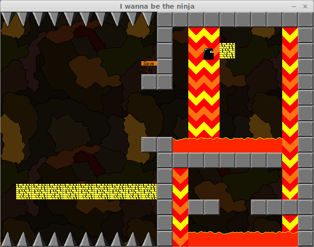

## I Wanna Be The Ninja 2 ##

ca. 2010 *(incomplete)*

The sequel to I Wanna Be The Ninja, a game inspired by [I Wanna Be The Guy](http://kayin.moe/iwbtg/).

This game is a little more fair, giving the player all of 2 (two!) hit points before dying. In most cases. Sometimes there are spikes and they count as an instant kill.

It plays like more of a Metroidvania, with nonlinear routes and powerups.

Since it was never finished, there are several areas which have warning stripes around them; this indicates that area was not completed and you should be advised about going there. (The game might just crash.) Other than that, the game is very polished and pretty. Personally, I think this was my best work.

Controls given in-game

### Screenshot ###

