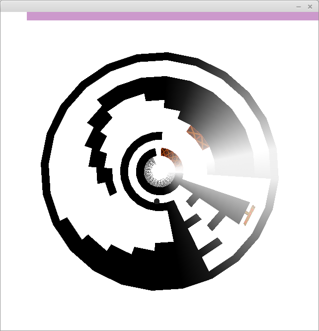

## Madness ##

ca. 2010

A puzzle-based platformer set in a world of polar coordinates. This means there's a bit of a twist to it.

The learning curve is weird. Early on there are some intimidating spikes, and about half-way through there is a fiendishly difficult jumping puzzle.

The save file does not persist when the game is closed. Be warned; it must be played in one sitting. If I ever get around to fixing up the source code I'll be sure to add this sorely-missed feature.

I was learning Japanese around this time, and for some reason thought that some hastily-drawn kanji would constitute a good title screen.

### Controls ###

`Up - Jump`

`Left/Right - Move`

### Screenshot ###

