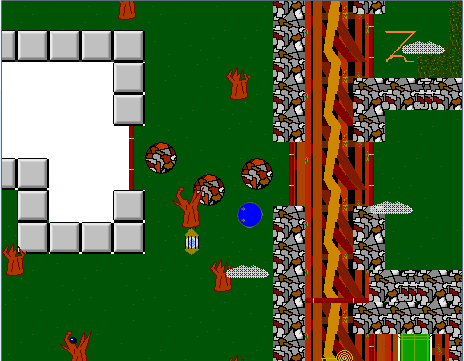

## Mazed ##

August 2007

One of the first games I made with Game Maker. This was actually a throwback to a simple maze game I made in 2002 with my older brother in Visual Basic, the first game I ever made.

The object is to collect all the keys on each level and then progress through the locked "Golden Door" onto the next level while dodging the dangerous え's. The game draws inspiration from Chip's Challenge, an old game bundled with the MS Entertainment Pack, along with other classics like Minesweeper and SkiFree.

### Controls ###

`Arrow Keys -- move around`

`Space -- save (on save point)`

`0 -- load`

`P -- pause`

### Screenshot ###

