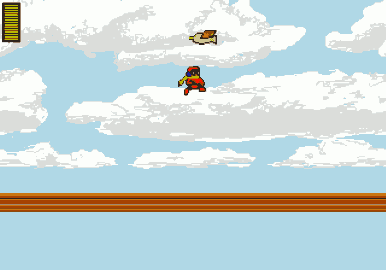

## Protoman ##

ca. 2010 *(incomplete)*

A Mega Man fangame in which you play as the mysterious Protoman. About as hard as Mega Man 2. Only 2 levels were ever completed, the third remains unfinished (and contains a bug that can cause the game to crash).

The game was remade from scratch in Java in 2011, but is still unfinished. I still hope to finish it some day after porting it my C++ SDL [Game Engine](https://github.com/nstbayless/sdlgame).

### Controls ###

`Z - Shoot`

`X - Jump`

`C - Menu`

`Arrow Keys - Move and Aim (for some weapons)`

### Screenshot ###

